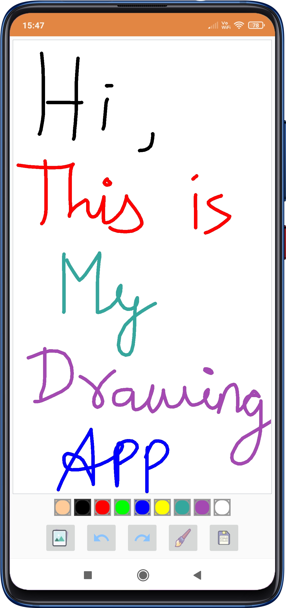
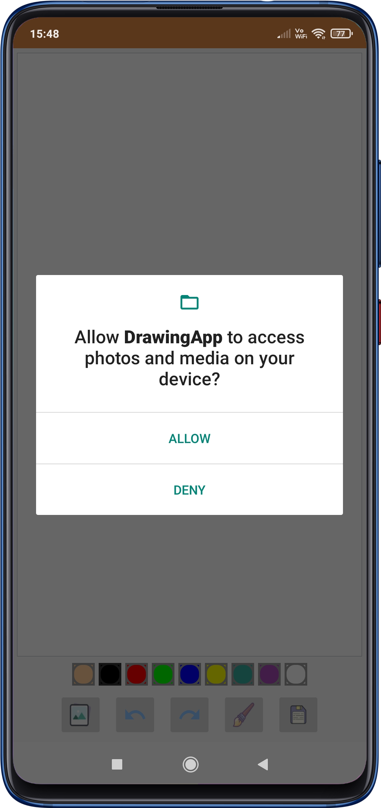
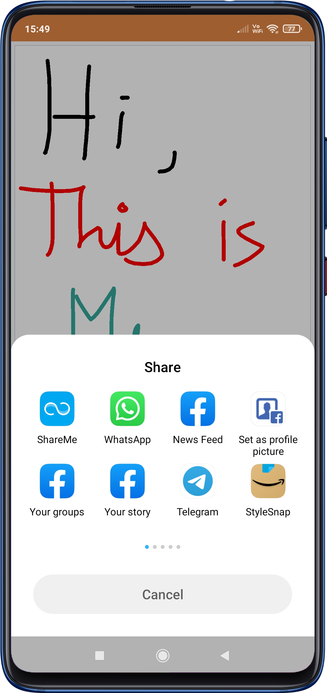

# Drawing App 

A drawing app written in kotlin with features like :

- Change brush size
- Redo and undo the last stroke
- Import existing images from device storage
- Share the drawing using various options in android

## Screenshots

  
   
  

